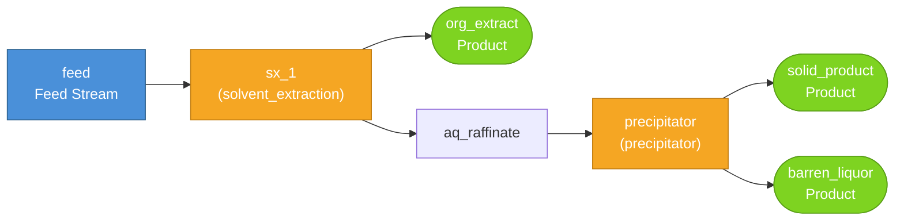

# REE Separation Process — Analysis Report

**Generated**: 2026-02-26 09:32:33
**Flowsheet**: `ree_nd_separation`

## 1. Analysis Request

I have an incoming aqueous chloride leach liquor containing a mixture of
Light Rare Earth Elements (LREEs). Design a flowsheet that isolates
**Neodymium (Nd)** with the highest possible recovery and lowest possible
Operating Expense (OPEX).

**Feed**: 1000 kg H₂O, 15 mol Nd³⁺, 20 mol Ce³⁺, 10 mol La³⁺, 50 mol HCl.
**Target KPI**: Minimize `overall.opex_USD`.
**Design Variables**: `organic_to_aqueous_ratio` [0.5, 5.0], `reagent_dosage_gpl` [1.0, 50.0].

## 2. System Description

The flowsheet `ree_nd_separation` consists of **2** unit operation(s) and **1** defined feed stream(s).

- **sx_1** (`solvent_extraction`): `organic_to_aqueous_ratio=1.5`
- **precipitator** (`precipitator`): `T_C=25.0`, `residence_time_s=3600.0`, `reagent_dosage_gpl=10.0`

## 3. Process Flowsheet

## 4. Stream States

| Stream | T (K) | P (Pa) | Total Flow (mol) | pH | Top Species |
|--------|-------|--------|------------------|----|-------------|
| feed | 298.1 | 101325 | 57198.51 | — | H2O(aq) (55508.44), HCl(aq) (1371.34), Ce+3 (142.74) |
| org_extract | 298.1 | 101325 | 242.01 | — | Ce+3 (107.06), Nd+3 (91.76), La+3 (43.20) |
| aq_raffinate | 298.1 | 101325 | 56956.49 | — | H2O(aq) (55508.44), HCl(aq) (1371.34), Ce+3 (35.69) |
| solid_product | 298.1 | 101325 | 56956.49 | -0.06 |  |
| barren_liquor | 298.1 | 101325 | 56956.49 | -0.06 | H2O(aq) (55508.44), H+ (1140.59), Cl- (1038.50) |

## 5. Performance Summary

### Baseline Results

| Metric | Value |
|--------|-------|
| Overall Recovery | 100.0% |
| OPEX (absolute) | $10.69 |
| LCA (absolute) | 58.62 kg CO₂e |
| OPEX (per kg product) | $0.01/kg |
| LCA (per kg product) | 0.05 kg CO₂e/kg |
| OPEX (per kg REE) | $0.22/kg REE |
| LCA (per kg REE) | 1.22 kg CO₂e/kg REE |
| Product Mass (total) | 1207.3273 kg |
| Product REE Mass | 48.1920 kg |

### Per-Unit Recovery

| Unit | Recovery |
|------|----------|
| sx_1 | 0.4% |
| precipitator | 100.0% |

## 6. Optimization Results (BoTorch)

### Optimal Parameters

| Parameter | Value |
|-----------|-------|
| organic_to_aqueous_ratio | 2.0720 |
| reagent_dosage_gpl | 1.0000 |

### Optimized Economics

| Metric | Baseline | Optimized | Change |
|--------|----------|-----------|--------|
| OPEX | $10.69 | $10.62 | +0.7% |
| LCA | 58.62 kg CO₂e | 58.62 kg CO₂e | — |
| OPEX/kg product | $0.01 | $0.01 | — |

### Convergence History

| Iteration | Best OPEX ($) |
|-----------|---------------|
| 0 | 10.7200 |
| 1 | 10.6200 |
| 2 | 10.6200 |
| 3 | 10.6200 |
| 4 | 10.6200 |
| 5 | 10.6200 |
