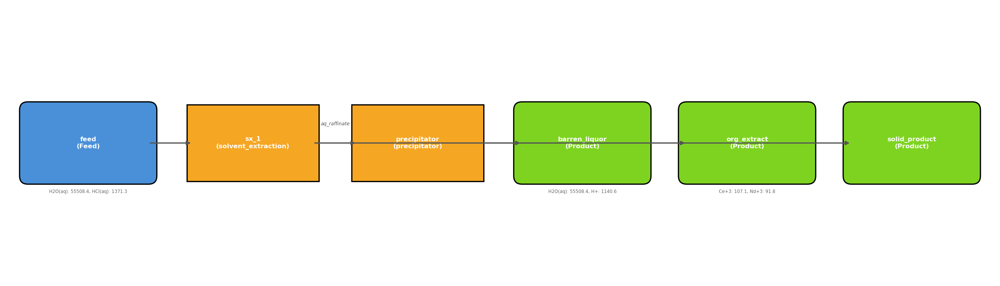

# REE Separation Process — Analysis Report

**Generated**: 2026-02-26 09:40:00
**Flowsheet**: `ree_nd_separation`

## 1. Analysis Request

I have an incoming aqueous chloride leach liquor containing a mixture of
Light Rare Earth Elements (LREEs). Design a flowsheet that isolates
**Neodymium (Nd)** with the highest possible recovery and lowest possible
Operating Expense (OPEX).

**Feed**: 1000 kg H₂O, 15 mol Nd³⁺, 20 mol Ce³⁺, 10 mol La³⁺, 50 mol HCl.
**Target KPI**: Minimize `overall.opex_USD`.
**Design Variables**: `organic_to_aqueous_ratio` [0.5, 5.0], `reagent_dosage_gpl` [1.0, 50.0].

## 2. System Description

The flowsheet `ree_nd_separation` consists of **2** unit operation(s) and **1** defined feed stream(s).

- **sx_1** (`solvent_extraction`): `organic_to_aqueous_ratio=1.5`
- **precipitator** (`precipitator`): `T_C=25.0`, `residence_time_s=3600.0`, `reagent_dosage_gpl=10.0`

## 3. Process Flowsheet

## 4. Stream States

| Stream | T (K) | P (Pa) | Total Flow (mol) | pH | Top Species (mol) |
|--------|------:|-------:|-----------------:|---:|-------------------|
| feed | 298.1 | 101325 | 57198.51 | — | H2O(aq) (55508.4), HCl(aq) (1371.3), Ce+3 (142.7) |
| org_extract | 298.1 | 101325 | 242.01 | — | Ce+3 (107.1), Nd+3 (91.8), La+3 (43.2) |
| aq_raffinate | 298.1 | 101325 | 56956.49 | — | H2O(aq) (55508.4), HCl(aq) (1371.3), Ce+3 (35.7) |
| solid_product | 298.1 | 101325 | 56956.49 | -0.06 |  |
| barren_liquor | 298.1 | 101325 | 56956.49 | -0.06 | H2O(aq) (55508.4), H+ (1140.6), Cl- (1038.5) |

## 5. Output-Specific Performance

All cost and emissions metrics are normalized to the **product output mass**.

| Metric | Value |
|--------|------:|
| Product Mass (total) | 1094.42 kg |
| Product REE Mass | 48.19 kg |
| Overall Recovery | 100.0% |
| **OPEX / kg product** | **$0.0098/kg** |
| **OPEX / kg REE** | **$0.2218/kg REE** |
| **LCA / kg product** | **0.0536 kg CO₂e/kg** |
| **LCA / kg REE** | **1.2164 kg CO₂e/kg REE** |
| OPEX (absolute) | $10.69 |
| LCA (absolute) | 58.62 kg CO₂e |

### Per-Unit Recovery

| Unit | Recovery |
|------|----------|
| sx_1 | 0.4% |
| precipitator | 100.0% |

## 6. Optimization Results (BoTorch)

### Optimal Parameters

| Parameter | Value |
|-----------|------:|
| organic_to_aqueous_ratio | 0.5000 |
| reagent_dosage_gpl | 1.0000 |

### Baseline vs. Optimized

| Metric | Baseline | Optimized | Δ |
|--------|----------|-----------|---|
| OPEX | $10.69 | $10.62 | +0.7% |
| LCA | 58.62 kg CO₂e | 58.62 kg CO₂e | — |
| OPEX/kg product | $0.0098 | $0.0097 | — |
| OPEX/kg REE | $0.2218 | $0.2204 | — |

### Convergence History

| Iteration | Best OPEX ($) |
|----------:|--------------:|
| 0 | 10.6600 |
| 1 | 10.6200 |
| 2 | 10.6200 |
| 3 | 10.6200 |
| 4 | 10.6200 |
| 5 | 10.6200 |
