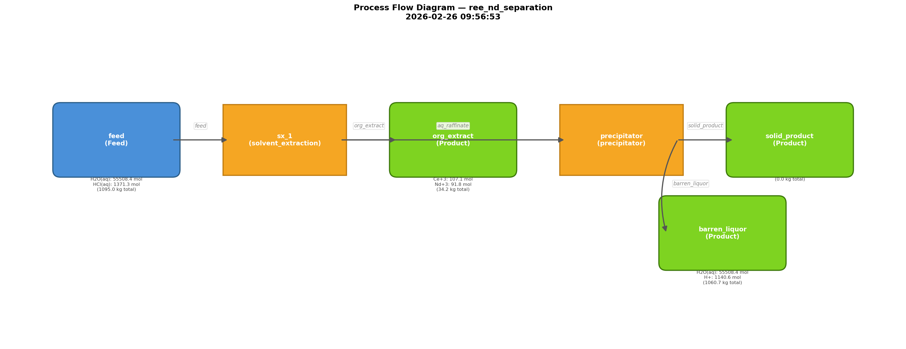

# REE Separation Process — Analysis Report

**Generated**: 2026-02-26 09:56:53
**Flowsheet**: `ree_nd_separation`

## 1. Analysis Request

I have an incoming aqueous chloride leach liquor containing a mixture of
Light Rare Earth Elements (LREEs). Design a flowsheet that isolates
**Neodymium (Nd)** with the highest possible recovery and lowest possible
Operating Expense (OPEX).

**Feed**: 1000 kg H₂O, 15 mol Nd³⁺, 20 mol Ce³⁺, 10 mol La³⁺, 50 mol HCl.
**Target KPI**: Minimize `overall.opex_USD`.
**Design Variables**: `organic_to_aqueous_ratio` [0.5, 5.0], `reagent_dosage_gpl` [1.0, 50.0].

## 2. System Description

The flowsheet `ree_nd_separation` consists of **2** unit operation(s) and **1** defined feed stream(s).

- **sx_1** (`solvent_extraction`): `organic_to_aqueous_ratio=1.5`
- **precipitator** (`precipitator`): `T_C=25.0`, `residence_time_s=3600.0`, `reagent_dosage_gpl=10.0`

## 3. Process Flowsheet

## 4. Stream States

| Stream | Type | T (K) | P (Pa) | Flow (mol) | Mass (kg) | pH | Top Species (mol) |
|--------|------|------:|-------:|-----------:|----------:|---:|-------------------|
| feed | **Feed** | 298.1 | 101325 | 57198.5 | 1094.99 | — | H2O(aq) (55508.4), HCl(aq) (1371.3), Ce+3 (142.7) |
| org_extract | Product | 298.1 | 101325 | 242.0 | 34.24 | — | Ce+3 (107.1), Nd+3 (91.8), La+3 (43.2) |
| aq_raffinate | Internal | 298.1 | 101325 | 56956.5 | 1060.75 | — | H2O(aq) (55508.4), HCl(aq) (1371.3), Ce+3 (35.7) |
| solid_product | Product | 298.1 | 101325 | 56956.5 | 0.00 | -0.06 |  |
| barren_liquor | Product | 298.1 | 101325 | 56956.5 | 1060.75 | -0.06 | H2O(aq) (55508.4), H+ (1140.6), Cl- (1038.5) |

## 5. Output-Specific Performance

### Mass Balance

| Category | Mass (kg) | Fraction |
|----------|----------:|---------:|
| Feed (total input) | 1094.99 | 100.0% |
| Feed (REE content) | 45.00 | 4.11% |
| **Product (valuable REE)** | **48.62** | — |
| Product (waste/residual) | 1046.36 | — |
| Product (total) | 1094.98 | — |

### Economic & Environmental Metrics

| Metric | Value |
|--------|------:|
| Overall Recovery | 100.0% |
| **OPEX / kg REE product** | **$0.2199/kg** |
| **LCA / kg REE product** | **1.2057 kg CO₂e/kg** |
| OPEX / kg total product | $0.0098/kg |
| LCA / kg total product | 0.0535 kg CO₂e/kg |
| **Estimated REE value / kg ore** | **$2.1966/kg ore** |
| OPEX / kg ore (input) | $0.009763/kg ore |
| Net value / kg ore | $2.1868/kg ore |
| REE product value (absolute) | $2405.22 |
| OPEX (absolute) | $10.69 |
| LCA (absolute) | 58.62 kg CO₂e |

### Per-Unit Recovery

| Unit | Recovery |
|------|----------|
| sx_1 | 0.4% |
| precipitator | 100.0% |

## 6. Optimization Results (BoTorch)

### Optimal Parameters

| Parameter | Value |
|-----------|------:|
| organic_to_aqueous_ratio | 1.9683 |
| reagent_dosage_gpl | 1.0000 |

### Baseline vs. Optimized

| Metric | Baseline | Optimized | Δ |
|--------|----------|-----------|---|
| OPEX | $10.69 | $10.62 | +0.7% |
| LCA | 58.62 kg CO₂e | 58.62 kg CO₂e | — |
| OPEX/kg REE | $0.2199 | $0.2184 | — |
| Net value/kg ore | $2.1868 | $2.1869 | — |

### Convergence History

| Iteration | Best OPEX ($) |
|----------:|--------------:|
| 0 | 10.6400 |
| 1 | 10.6200 |
| 2 | 10.6200 |
| 3 | 10.6200 |
| 4 | 10.6200 |
| 5 | 10.6200 |
