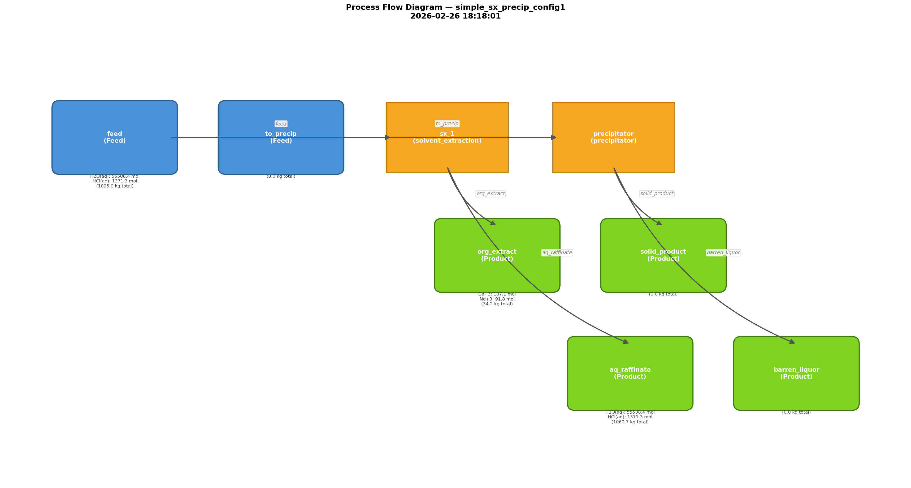

# REE Separation — GDP Superstructure Optimization Report

**Generated**: 2026-02-26 18:18:01  
**Superstructure**: simple_sx_precip  
**Objective**: minimize_opex  
**Configurations Evaluated**: 2  
**Total Runtime**: 1.1s

---

## 1. Topology Ranking

| Rank | Active Units | OPEX ($) | LCA (kgCO₂e) | Recovery | Status |
|:----:|-------------|--------:|-------------:|---------:|:------:|
| 1 🏆 | precipitator, sx_1 | 10.69 | 58.62 | 100.00% | OK |
| 2 ✅ | precipitator, scrubber, sx_1 | 10.85 | 59.52 | 100.00% | OK |

---

## 2. Best Configuration — 🏆

**Active units**: precipitator, sx_1  
**Bypassed units**: scrubber  

- **sx_1** (`solvent_extraction`): `organic_to_aqueous_ratio=1.5`
- **precipitator** (`precipitator`): `residence_time_s=3600.0`, `reagent_dosage_gpl=10.0`

## 3. Process Flowsheet

## 4. Stream States

| Stream | Type | T (K) | P (Pa) | Flow (mol) | Mass (kg) | pH | Top Species (mol) |
|--------|------|------:|-------:|-----------:|----------:|---:|-------------------|
| feed | **Feed** | 298.1 | 101325 | 57198.5 | 1094.99 | — | H2O(aq) (55508.4), HCl(aq) (1371.3), Ce+3 (142.7) |
| to_precip | **Feed** | 298.1 | 101325 | 100.0 | 0.00 | — |  |
| org_extract | Product | 298.1 | 101325 | 242.0 | 34.24 | — | Ce+3 (107.1), Nd+3 (91.8), La+3 (43.2) |
| aq_raffinate | Product | 298.1 | 101325 | 56956.5 | 1060.75 | — | H2O(aq) (55508.4), HCl(aq) (1371.3), Ce+3 (35.7) |
| solid_product | Product | 298.1 | 101325 | 100.0 | 0.00 | -1.74 |  |
| barren_liquor | Product | 298.1 | 101325 | 100.0 | 0.00 | -1.74 |  |

## 5. Output-Specific Performance

### Mass Balance

| Category | Mass (kg) | Fraction |
|----------|----------:|---------:|
| Feed (total input) | 1094.99 | 100.0% |
| Feed (REE content) | 45.00 | 4.11% |
| **Product (valuable REE)** | **45.00** | — |
| Product (waste/residual) | 1049.98 | — |
| Product (total) | 1094.99 | — |

### Economic & Environmental Metrics

| Metric | Value |
|--------|------:|
| Overall Recovery | 100.0% |
| **OPEX / kg REE product** | **$0.2375/kg** |
| **LCA / kg REE product** | **1.3026 kg CO₂e/kg** |
| OPEX / kg total product | $0.0098/kg |
| LCA / kg total product | 0.0535 kg CO₂e/kg |
| **Estimated REE value / kg ore** | **$2.1096/kg ore** |
| OPEX / kg ore (input) | $0.009763/kg ore |
| Net value / kg ore | $2.0999/kg ore |
| REE product value (absolute) | $2310.03 |
| OPEX (absolute) | $10.69 |
| LCA (absolute) | 58.62 kg CO₂e |

### Per-Unit Recovery

| Unit | Recovery |
|------|----------|
| sx_1 | 0.4% |
| precipitator | 100.0% |

---

## 6. All Configurations (Comparison)

### Config #1 🏆: [precipitator, sx_1]

- **Bypassed**: scrubber
- **Objective**: 10.6900
- **Runtime**: 0.58s

| KPI | Value |
|-----|------:|
| `overall.lca_kg_CO2e` | 58.6200 |
| `overall.opex_USD` | 10.6900 |
| `overall.recovery` | 1.0000 |
| `precipitator.recovery` | 1.0000 |
| `sx_1.recovery` | 0.0042 |

### Config #2: [precipitator, scrubber, sx_1]

- **Bypassed**: none
- **Objective**: 10.8500
- **Runtime**: 0.55s

| KPI | Value |
|-----|------:|
| `overall.lca_kg_CO2e` | 59.5200 |
| `overall.opex_USD` | 10.8500 |
| `overall.recovery` | 1.0000 |
| `precipitator.recovery` | 1.0000 |
| `scrubber.recovery` | 0.0982 |
| `sx_1.recovery` | 0.0042 |
